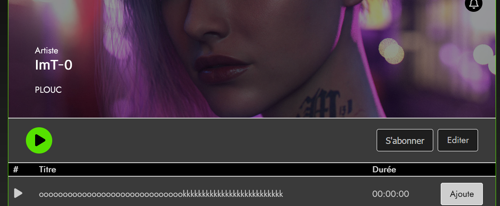

# Spotify 'Clone'

Alright so let me introduce one of my biggest project so far.

This site acts like spotify in some way.

# What is the purpose of this site ?

Well if nothing is broken (lol) basicly you can have a users/artists/admin hierarchy.

All of those "roles" needs to go through the signup steps first in order to use the rest of the site.

Once users are logged in for the first time, they will be notified with a "recover-token" message.

They can save it somewhere for later in case they need a password reset.

## 1) Users can :

- Manage playlists:
    - Create using a "+" button.

    

    - Update by clicking on it, then look after an "edit" button.

    .png)

    - Add music tracks, this requires that an Artist has published a music track.

    

    - Delete playlists.

    

- Manage their profile.

    - Update their account information as well as deleting it.s

    - Create an Artist profile look after on your "profile" 

    

- Contact the "support" through the site.

    - The notification system also allow to interact with the administration so in case a user has a question, he can "submit" a ticket.
    - Only 1 ticket can be submited at a time by a user until its responded.

## 2) Artists can :

- Manage their artist profile

    - This includes adding tracks

    - And of course modifying the artist name and so on.

# What is wrong with the site ?

A lot I guess lol, to be honest 

# Why is it this way ?

Due to certain project restrictions, such as the inability use libraries or add-ons, some functionalities may be less than ideal.

For instance, audio cannot be played across different pages.

However, it was crucial that the site function independently of Javascript, I've done my best to ensure this is the case !