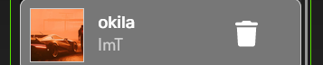

# Spotify 'Clone'

Alright so let me introduce one of my biggest project so far.
This site acts like spotify in some way.

# What is the purpose of this site ?

Well if nothing is broken (lol) basicly you can have a user/artists/admin hierarchy.

1) Users can :
   
    - Manage playlists:
        - Create using a "+" button.
        
        - Update by clicking on it, then look after an "edit" button.
        .png)
        - Add music tracks, this requires that an Artist has published a music track.
        
        - Delete playlists.
        
    - Manage their profile.
        - Update their account information as well as deleting it.
        - Create an Artist profile look after on your "profile" 
        

